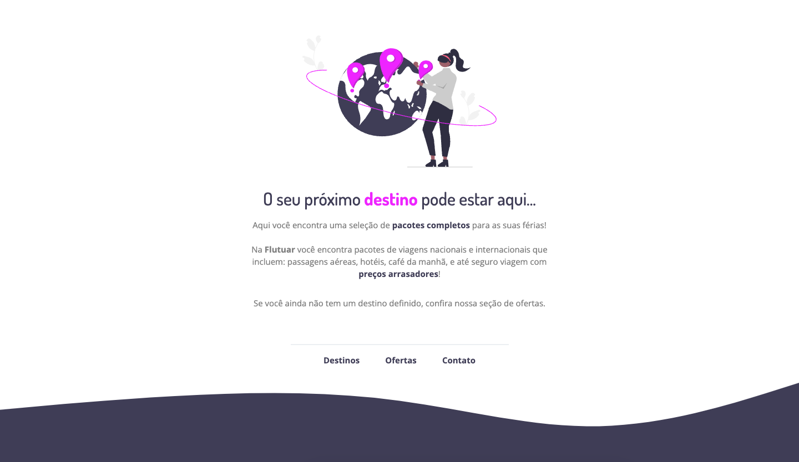

# Stage 02 - Aula 01

  

<h3 align="center">
  Exercício desenvolvido no programa de formação Explorer da Rocketseat.
</h3>

Clique **[aqui](https://eduardofariasdev.github.io/explorer/stage02/aula02/)** para abrir a página no seu navegador.

